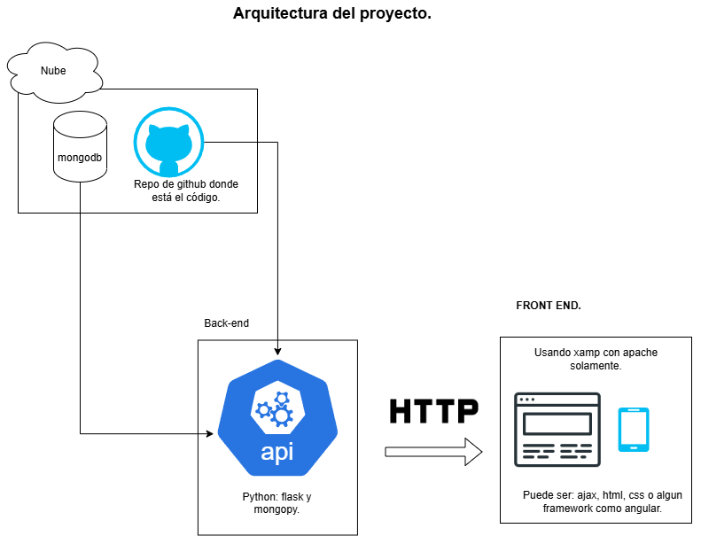

# 🌐 Curso *Plataformas Abiertas*

## 📂 Descripción
Repositorio del curso *Plataformas Abiertas* por el 🧑‍🏫 profesor Daniel.  

Acá estarán todos los archivos relacionados al curso. 📁💻  

---
# Guías y Recursos

➡️ [Readme principal de Git y GitHub](./Semana%2001%20a%2005/git-github/README.md)
---

## 🛠️ Lenguaje de Etiquetado Markdown
Estos archivos usan un lenguaje de etiquetado para dar formato al texto.  

Para más detalle, visita [acá](https://www.markdownguide.org/basic-syntax/). 🖋️  

 
# Arquitectura del proyecto

