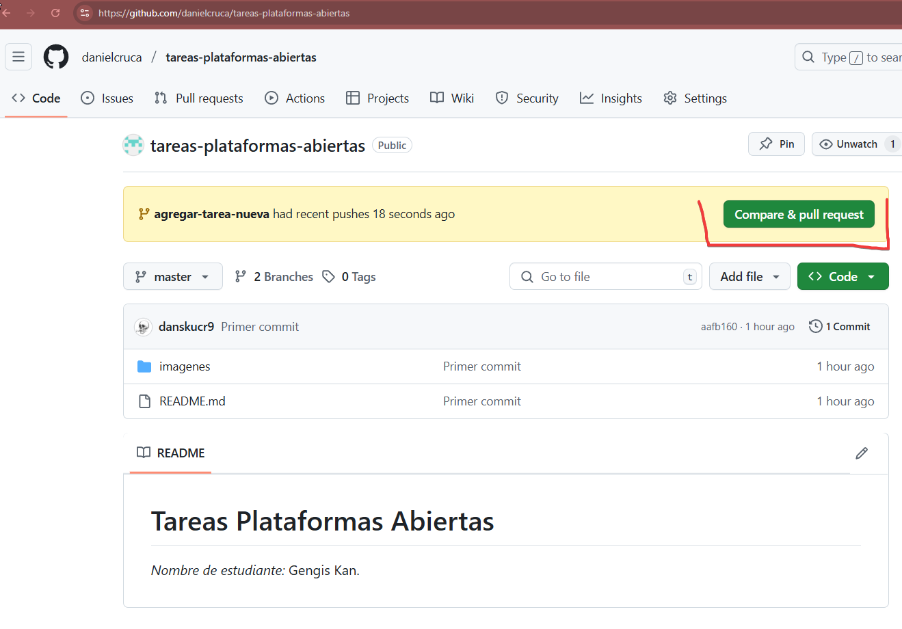
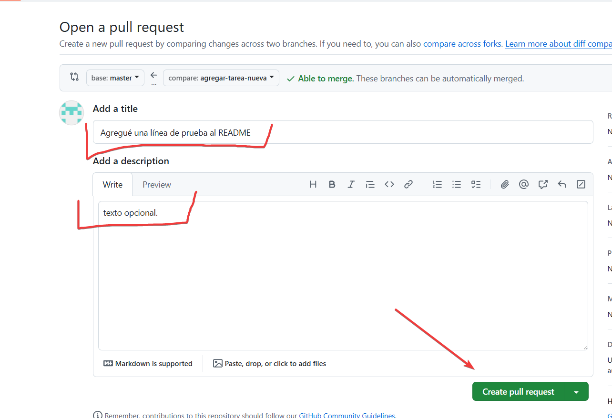
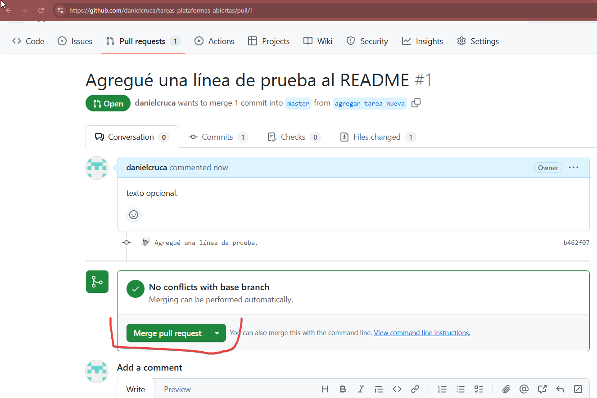
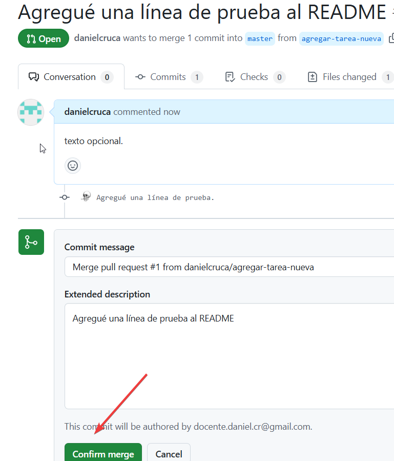
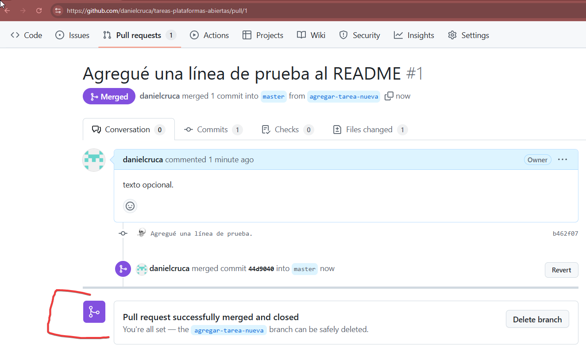

# 🌿 Continuación: Crear un Branch y Hacer un Pull Request

Ahora que ya tiene su repositorio en GitHub y has hecho tu primer push, veremos lo siguiente:

- Crear un branch (rama) nuevo
- Hacer cambios en ese branch
- Subir esos cambios a GitHub
- Hacer un Pull Request (PR)

---

## 🌱 Paso 10: Crear un Branch

Desde tu terminal, estando en la raíz de tu proyecto, escribe:

```bash
git checkout -b nombre-de-tu-rama
```

Por ejemplo:

```bash
git checkout -b agregar-tarea-nueva
```

Esto crea una nueva rama y cambia a ella.

---

## 🧪 Paso 11: Haz Cambios en Tu Proyecto

Por ejemplo, edita tu archivo `README.md` y agrega una línea nueva como:

```markdown
Agregado desde el branch agregar-tarea-nueva 🚀
```

Guarda los cambios.

---

## 💾 Paso 12: Haz Commit en el Nuevo Branch

Primero, agrega los cambios al área de staging:

```bash
git add .
```

Luego haz commit:

```bash
git commit -m "Agregué una línea de prueba."
```

---

## ⬆️ Paso 13: Sube el Branch a GitHub

```bash
git push origin agregar-tarea-nueva
```

Esto sube tu nueva rama al repositorio en GitHub.

---

## 🔁 Paso 14: Crear un Pull Request (PR)

1. Ve a tu repositorio en [https://github.com](https://github.com)
2. GitHub te mostrará un botón que dice **"Compare & pull request"**. Haz clic.

3. Escribe un título y una descripción (ejemplo: "Agregué nueva línea al README").
4. Haz clic en **"Create pull request"**.

5. Con esto has creado un Pull Request. 🎉

---

## ✅ Paso 15: Fusionar (Merge) el Pull Request

Un administrador del repositorio puede revisar el PR y, si está bien, hacer clic en **"Merge pull request"** para integrarlo en la rama principal.




 
---

## 🧹 Paso 16: (Opcional) Eliminar la Rama

Una vez fusionado, puede borrar la rama desde GitHub o desde tu terminal:

```bash
git branch -d agregar-tarea-nueva
```

Si ya hiciste merge, pero el branch sigue en GitHub, elimínalo con:

```bash
git push origin --delete agregar-tarea-nueva
```

---

## 🔁 Resumen Visual del Flujo

```plaintext
main
│
├───➤ crear rama ➤ editar ➤ commit ➤ push ➤ pull request ➤ merge ➤ ¡listo!
```

---