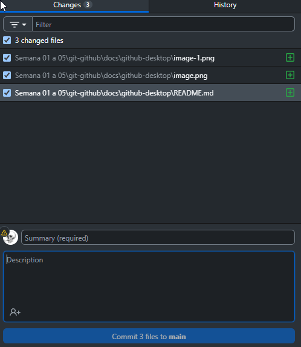
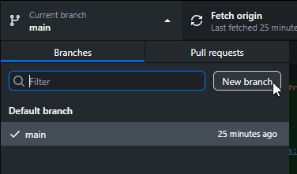
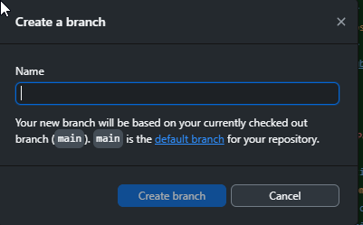

# 🐱 GitHub Desktop: Guía Fácil para Principiantes

## ✅ Requisitos

- Tener una cuenta en GitHub 👉 [https://github.com](https://github.com)
- Tener GitHub Desktop instalado 👉 [https://desktop.github.com](https://desktop.github.com)

---

## 🧱 Paso 1: Crear un Repositorio en GitHub

1. Inicia sesión en [https://github.com](https://github.com)
2. Haz clic en el botón **"New"**
3. Escribe:
   - **Repository name**: `mi-primer-repo`
   - (Opcional) Una descripción
4. Marca la opción **"Add a README file"**
5. Haz clic en **"Create repository"**

---

## 💻 Paso 2: Descargar GitHub Desktop

1. Ve a 👉 [https://desktop.github.com](https://desktop.github.com)
2. Descarga e instala GitHub Desktop
3. Ábrelo e inicia sesión con tu cuenta de GitHub

---

## 📥 Paso 3: Clonar el Repositorio en GitHub Desktop

1. En GitHub Desktop, haz clic en **"File > Clone repository..."**
2. Verás tus repositorios de GitHub. Selecciona el que creaste: `mi-primer-repo`
3. Elige la carpeta donde querés guardarlo localmente
4. Haz clic en **"Clone"**

---

## 📝 Paso 4: Editar Archivos Localmente

1. Abre la carpeta del repositorio en tu computadora.
2. Agrega o edita archivos (por ejemplo, `README.md`).
3. Volvé a GitHub Desktop: verás los cambios detectados automáticamente.

---

## 💾 Paso 5: Hacer Commit

1. Escribí un mensaje de resumen, por ejemplo:  
   `"Agregué mi nombre al README"`
2. Hacé clic en el botón **"Commit to main"**.

---

## ☁️ Paso 6: Subir los Cambios a GitHub (Push)

Después de hacer commit:

1. Hacé clic en el botón **"Push origin"**.
2. Esto subirá los cambios al repositorio en GitHub.

Con esto su proyecto está actualizado en la nube(github). 🚀

---

## 🌿 Paso 7 (Opcional): Crear una Rama (Branch)

1. En la esquina superior izquierda, hacé clic en el nombre de la rama actual (`main`)
2. Escribí el nombre de una nueva rama, por ejemplo: `rama-tarea`.
3. Hacé clic en **"Create Branch"**.
4. Hacé tus cambios, commit y push como antes.

---

## 🔁 Paso 8: Crear un Pull Request (PR)

1. Ve al repositorio en GitHub.com
2. GitHub te mostrará un botón: **"Compare & pull request"**
3. Hacé clic, agregá título y descripción, y luego **"Create pull request"**

---

## 🧠 Tips

- Usá ramas sirve para organizar tus cambios sin romper el código principal(main).
- Usar mensajes claros en los commits
- GitHub Desktop es mas visual que la terminal, pero es bueno saber el flujo por medio de comandos.

---

## 📚 Recursos

- Guía Git + GitHub básica: [ver aquí](https://github.com/danielcruca/plataformas-abiertas/blob/main/Semana%2001%20a%2005/git-github/docs/guia-inicial/README.md)
- Guía de ramas y pull requests: [ver aquí](https://github.com/danielcruca/plataformas-abiertas/tree/7192c1ede7d43e04840a3a38904ad0b3dc11495f/Semana%2001%20a%2005/git-github/docs/branch)
- GitHub Desktop Docs: [https://docs.github.com/en/desktop](https://docs.github.com/en/desktop)

