# 🚀 Guía Completa: Crear un Repositorio Git y Subirlo a GitHub

## ✅ Requisitos Previos

1. Tener **Git instalado**  
   👉 [https://git-scm.com/downloads](https://git-scm.com/downloads)

2. Tener una **cuenta de GitHub**  
   👉 [https://github.com](https://github.com)

---

# Parte 1: Uso de git(local) 

---
## 🛠️ Paso 1: Configurar Git (solo la primera vez)

Abre una terminal y ejecuta los siguientes comandos:

```bash
git config --global user.name "Tu Nombre"
git config --global user.email "tucorreo@example.com"
```

---

## 📁 Paso 2: Crear un Proyecto Nuevo

1. Crea una carpeta con el nombre de tu proyecto, por ejemplo:  
   `C:\Users\TU-USUARIO\Documents\Proyectos\MI-NOMBRE-DE-PROYECTO`
2. Abre la carpeta con Visual Studio Code.
3. Una vez abierta, accede a la terminal integrada.

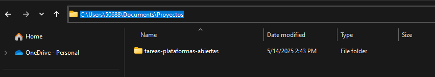
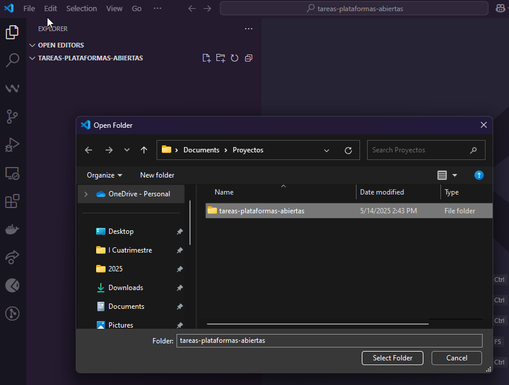
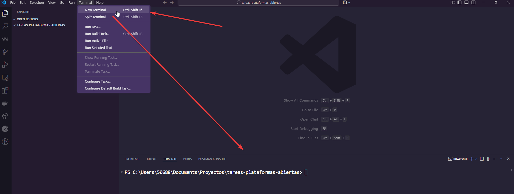

---

## 🔧 Paso 3: Inicializar el Repositorio Git

Inicializa el repositorio local con:

```bash
git init
```

Vera algo como esto:

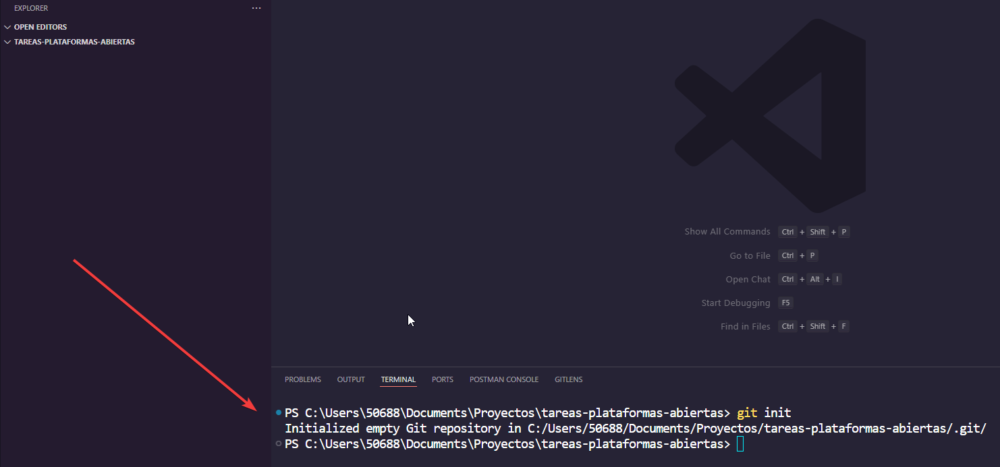

---

## 📝 Paso 4: Crear un Archivo README y Agregar Imágenes

1. Crea un archivo llamado `README.md` y escribe lo siguiente:

```markdown
# Tareas Plataformas Abiertas

*Nombre de estudiante:* TU NOMBRE Y APELLIDOS.
```

2. Crea una carpeta llamada `imagenes`.
3. Descarga una imagen cualquiera y colócala dentro de la carpeta `imagenes`.  
   Puede usar esta:  
   👉 

Hasta este momento, el proyecto se debe ver así:  
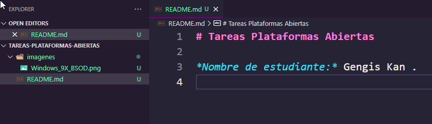

---

## ➕ Paso 5: Agregar Archivos al Staging

El área de *staging* es donde preparas los archivos antes de confirmarlos (commit).

```bash
git add .
```

Para verificar los archivos agregados, ejecuta:

```bash
git status
```

Veras algo como esto:

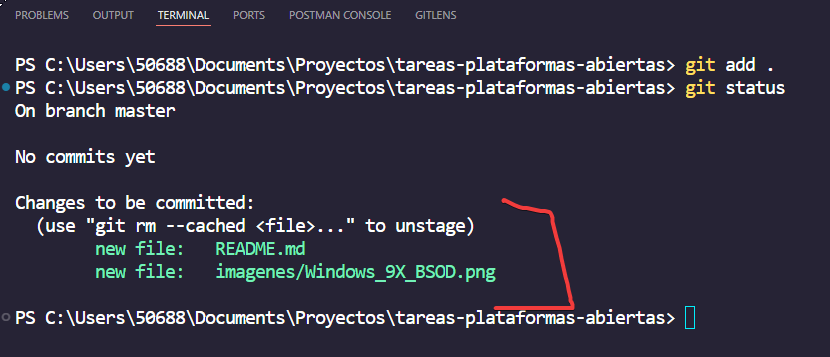

Esto significa que los archivos fueron agregados a la zona de *staging* y listos para ser confirmados.
---

## 💾 Paso 6: Hacer un Commit

Un *commit* guarda los cambios en tu repositorio local.

El parámetro *-m* es para agregar un *mensaje descriptivo*, puede agregar cualquier cosa mientras sea descriptiva.

```bash
git commit -m "Primer commit"
```
Acá vera otro ejemplo de comentarios para los commit, por si gusta probar algo mas significativo:

```bash
git commit -m "Agregado soporte a base de datos."
# Otro ejemplo:
git commit -m "Arregla timeout en produccion."

```

Luego de ejecutar esto deberias ver algo como esto:


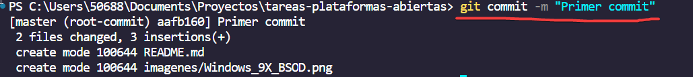

---
# Parte 2: Uso de github(en la nube) e integración con git(local). 
---
## 🌐 Paso 7: Crear un Repositorio en GitHub

1. Ve a [https://github.com](https://github.com)
2. Haz clic en **Create repository**
3. Escribe el nombre del repositorio (ej. `tareas-plataformas-abiertas`)
4. **Desmarca**(si está marcada) la opción *Initialize this repository with a README*
5. Haz clic en **Create repository**

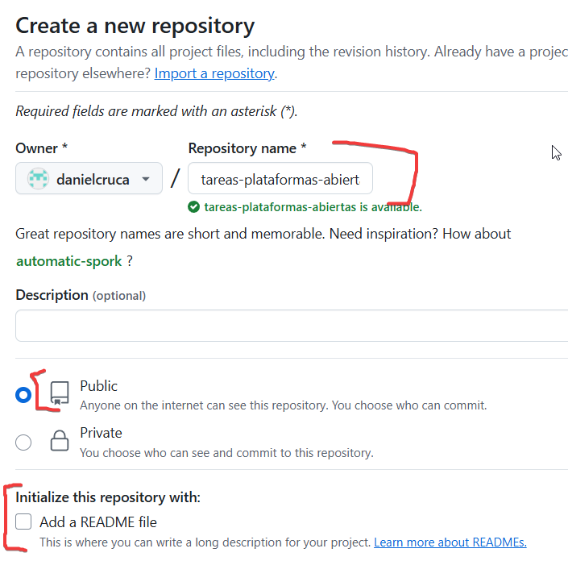
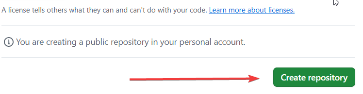

---

## 🔗 Paso 8: Conectar el Repositorio Local con GitHub

1. Copia la URL del repositorio recién creado.
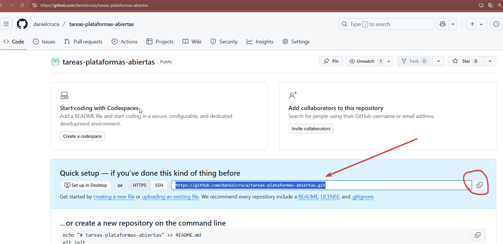
2. En la terminal, ejecute el siguiente comando:
```bash
   git branch -M main
```
3. En la terminal, ejecute el siguiente comando usando la URL copiada:
```bash
git remote add origin https://github.com/TU-USUARIO/tareas-plataformas-abiertas.git
```

Esto enlaza tu repositorio local con el repositorio remoto en GitHub.

Nota que la palabra origin es el "nombre" que le diste a tu repositorio en GitHub.
---

## 🚀 Paso 9: Subir tu Proyecto a GitHub

Para subir tu proyecto por primera vez a la nube, ejecuta:

```bash
git push -u origin main
```

> ⚠️ Si tu rama principal se llama `master`, usa en su lugar solo si esto se cumple:
>
> ```bash
> git push -u origin master
> ```
Despues de esto, posiblemente te salga una pantalla como para autenticarte.

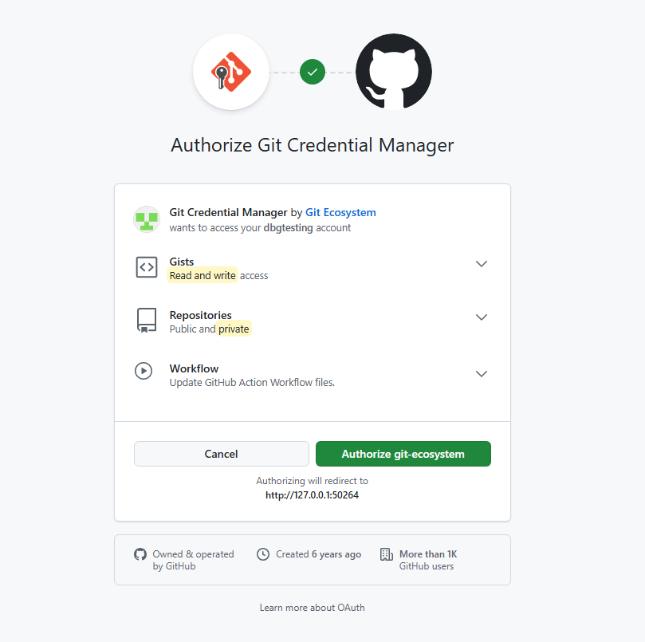

y luego:

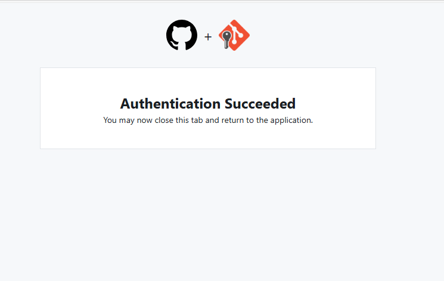

La consola debera mostrar algo como esto:

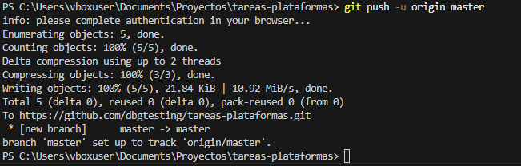

---

🚀 ¡Listo! Tanto el repositorio local como el remoto(la nube) estan sincronizados.

Si desea agregar mas archivos, siga  los pasos: 4, 5, 6  y luego el 9, que seria algo asi:

```bash
# 1. Agregar los cambios al área de staging(todos los archivos).
git add .
# O si solo desea agregar un archivo en specifico y no todos seria:
git add arhivo-nuevo.py

# 2. Confirmar (commit) los cambios con un mensaje descriptivo
git commit -m "Agrega nueva función de búsqueda en app.py"

# 3. Enviar (push) los cambios al repositorio remoto, rama principal (main o master)
git push origin main
```

# Resumen

Basicamente esto son los comandos a ejecutar siguiendo la guia:

```bash

# Crear un archivo en el repositorio local
git init # Iniciar repo en local
git add . #Agregar todos los cambios a staging
git commit -m "first commit" # Hacer commit y confirmar los cambios.
git branch -M main # Renombrar la rama principal a main. " Solo se debe hacer una vez"
git remote add origin https://github.com/su-usuario/su-proyecto.git # Agregar el repositorio de la nube. Solo se debe hacer una vez.
git push -u origin main # Subir los cambios a la nube crear en ella una ramma main.

```


## 🛠️ Comandos Útiles

Ver estado de los archivos:

```bash
git status
```

Ver historial de commits:

```bash
git log
```

## Clonar un repositorio existente:


Por ejemplo, si desea clonar el repositorio de este curso puede hacerlo de la siguiente manera:
```bash
git clone https://github.com/danielcruca/plataformas-abiertas.git
```
Aquí el repo ya existe y entonces solo se hace esto.

# Agregar colaboradores

Para trabajar colaborativamente con otros desarrolladores, puedes agregarlos como colaboradores de su repositorio.

1. Vaya a la configuracion de su repositorio.

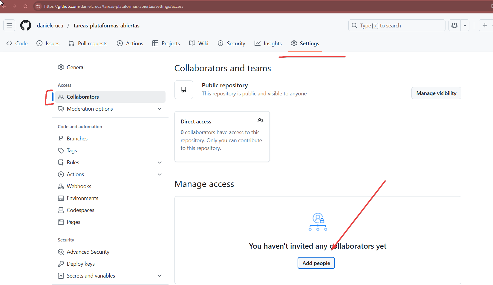
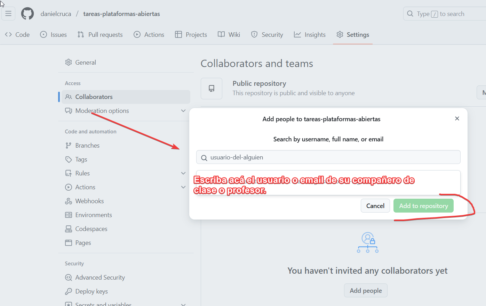

*Nota*: 
1. Solo los administradores del repositorio pueden agregar colaboradores.
2. El usuario del profesor es: **danielcruca**.

# Flujo
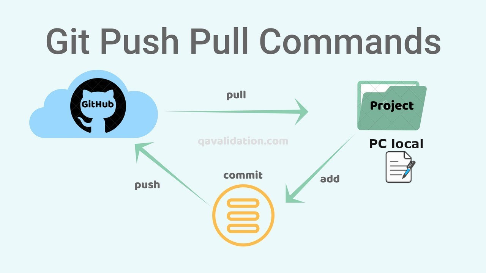