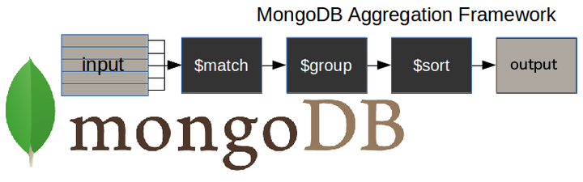
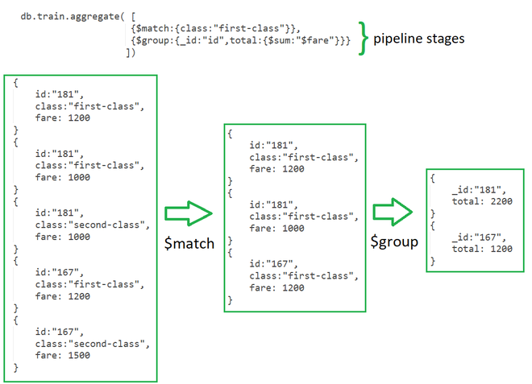

# 📘 Consultas en MongoDB - Parte 2


# 🔧 Agregaciónes funcionamiento
Un pipeline de agregación es como una línea de producción en la que vas procesando los datos paso por paso.


Cada paso se llama una etapa (stage), y podés  combinarlas. Las más comunes son:

| Etapa      | ¿Qué hace?                                               | Ejemplo simple                                 |
|------------|----------------------------------------------------------|------------------------------------------------|
| `$match`   | Filtra documentos (como un WHERE)                        | Solo ventas del 2025                           |
| `$group`   | Agrupa documentos y calcula valores (como un GROUP BY)   | Total vendido por producto                     |
| `$sort`    | Ordena los resultados                                    | De mayor a menor cantidad vendida              |
| `$project` | Escoge y transforma los campos que querés mostrar        | Mostrar solo nombre y total                    |
| `$limit`   | Muestra solo cierta cantidad                             | Los 5 productos más vendidos                   |
| `$lookup`  | Une datos de otra colección (como un JOIN en SQL)        | Buscar el stock del producto en otra tabla     |





## 1. Agregaciones con `$aggregate`

Las agregaciones permiten procesar datos y devolver resultados resumidos.
 Se usan etapas como: `$match`, `$group`, `$sort`, `$project`, entre otras.

---

### a. 📅 Cantidad vendida de libros por fecha específica

**Conceptos:**
- Filtrado con `$match`
- Agrupación con `$group`
- Ordenamiento con `$sort`

```js
db.ventas.aggregate([
  {
    $match: {
      fecha_venta: new Date("2025-05-12") //  Fecha específica
    }
  },
  {
    $group: {
      _id: "$libro.titulo", // Agrupar por título del libro
      cantidad_vendida: { $sum: "$cantidad" } // Sumar cantidad vendida
    }
  },
  {
    $sort: { cantidad_vendida: -1 } // Ordenar de mayor a menor -1 es descendente y 1 es ascendente
  }
]);
```
Posible equivalente en SQL:

```sql
  SELECT 
    l.titulo AS titulo,
    SUM(v.cantidad) AS cantidad_vendida
  FROM 
    ventas v
  JOIN 
    libros l ON v.id_libro = l.id
  WHERE 
    v.fecha_venta = '2025-05-12'
  GROUP BY 
    l.titulo
  ORDER BY 
    cantidad_vendida DESC;
```

---

### b. 📚 Libros con al menos una venta

**Opciones:**
- `$group` para agrupar por libro
- `$match` para filtrar resultados después
- `$lookup` (opcional) para combinar con otra colección

```js
db.ventas.aggregate([
  {
    $match: {
      cantidad: { $gt: 0 }
    }
  },
  {
    $group: {
      _id: "$libro.titulo",
      cantidad_vendida: { $sum: "$cantidad" }
    }
  },
  {
    	$sort: { cantidad_vendida: -1 }
  }
]);

```
Posible equivalente en SQL:

```sql
  SELECT 
    libro_titulo AS titulo,
    SUM(cantidad) AS cantidad_vendida
  FROM 
    ventas
  WHERE 
    cantidad > 0
  GROUP BY 
    libro_titulo
  ORDER BY 
    cantidad_vendida DESC;
```

---

### c. 📦 Libros vendidas y su stock restante

**Conceptos:**
- `$lookup` para combinar con libros similar a un JOIN.
- `$project` para mostrar campos personalizados

```js
db.ventas.aggregate([
  {
    $group: {
      _id: "$libro.titulo",
      cantidadVendida: { $sum: "$cantidad" }
    }
  },
  {
    $lookup: {
      from: "libros",  // JOIN con libros
      localField: "_id",  // id de ventas despues de la agrupación.
      foreignField: "titulo", // Titulo se usa como simular clave foranea, recuerdo que clave foranea no existe en MongoDB pero se puede simular.
      as: "info_libro" // Esto es un nombre  tipo variable.
    }
  },
    {
    $unwind: "$info_libro" // El lookup es un array, hay que descomprimirlo para poder usarlo.
  },
  {
    $project: { // aqui se muestran los campos que queremos mostrar.
      _id: 1, // El 1 indica que se muestre el campo _id, si es 0 no se muestra
      titulo: "$_id", // renombramos id como titulo
      cantidadInicial: "$info_libro.cantidad_stock",
      cantidadVendida: 1,
      cantidadRestante: {
      $subtract: [
          "$info_libro.cantidad_stock",
          "$cantidadVendida"
        ]
      }
    }
  },
  {
    $sort: { cantidadVendida: -1 } // -1 es descendente y 1 es ascendente.
  }
]);

```

---

### d. 🏆 Top 5 libros más vendidos

**Pasos:**
1. Agrupar por título
2. Sumar cantidades
3. Ordenar
4. Limitar

```js
db.ventas.aggregate([
  {
    $group: {
      _id: "$libro.titulo",                  // Agrupar por título
      cantidadVendida: { $sum: "$cantidad" } // Sumar cantidad vendida.
    }
  },
  {
    $sort: { cantidadVendida: -1 }           // Ordenar descendente -1 y ascendente 1
  },
  {
    $limit: 5                                // Limitar a top 5
  }
]);
```

---

### Ejemplo sencillo

Obtener todos los libros por autor.

```js
db.libros.aggregate([
  {
    $group: {
      _id: "$autor",            // Agrupa por nombre del autor
      totalLibros: { $sum: 1 }  // Cuenta cuántos libros tiene cada autor
    }
  },
  {
    $sort: { totalLibros: -1 }  // Ordena de mayor a menor cantidad
  }
]);

```
