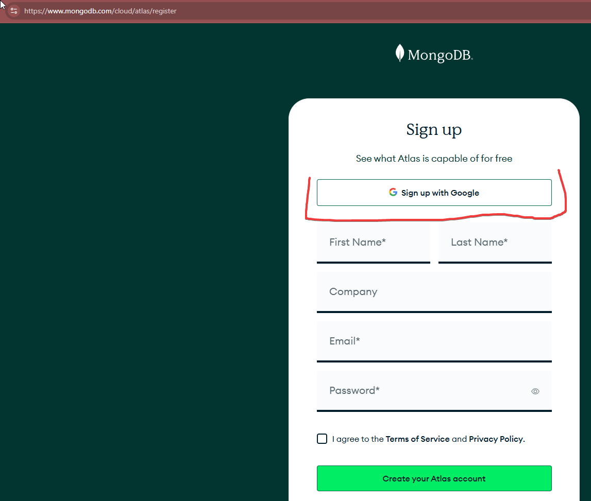
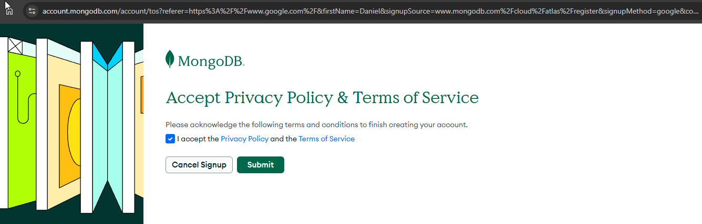
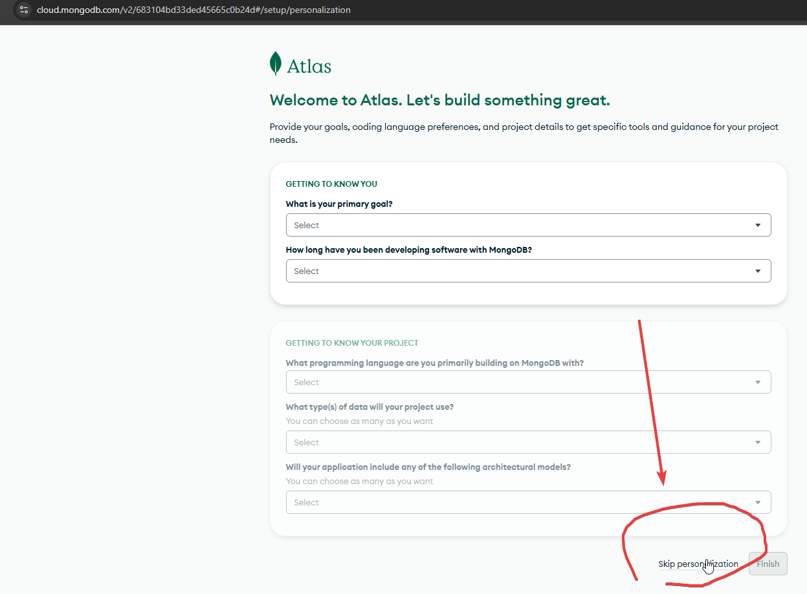
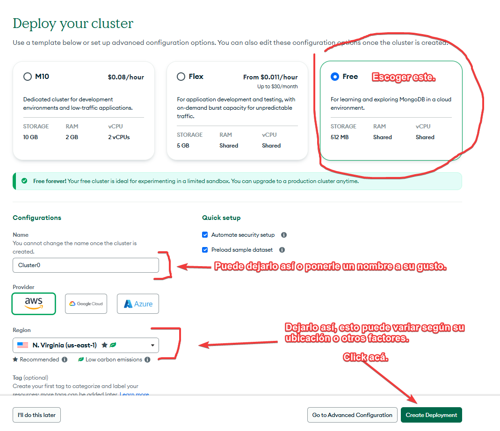
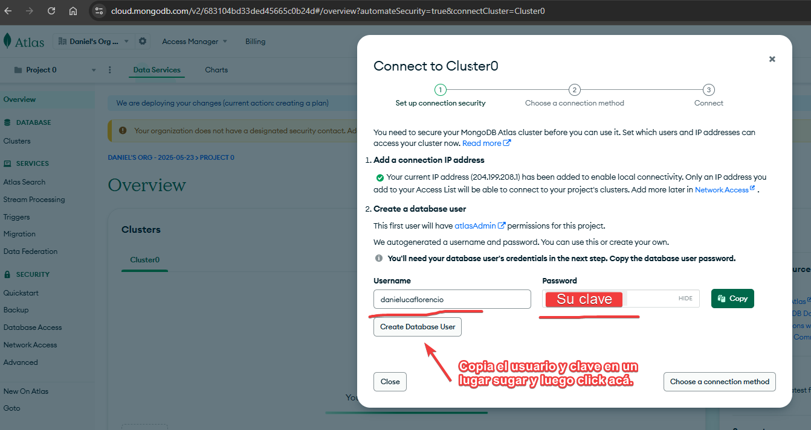
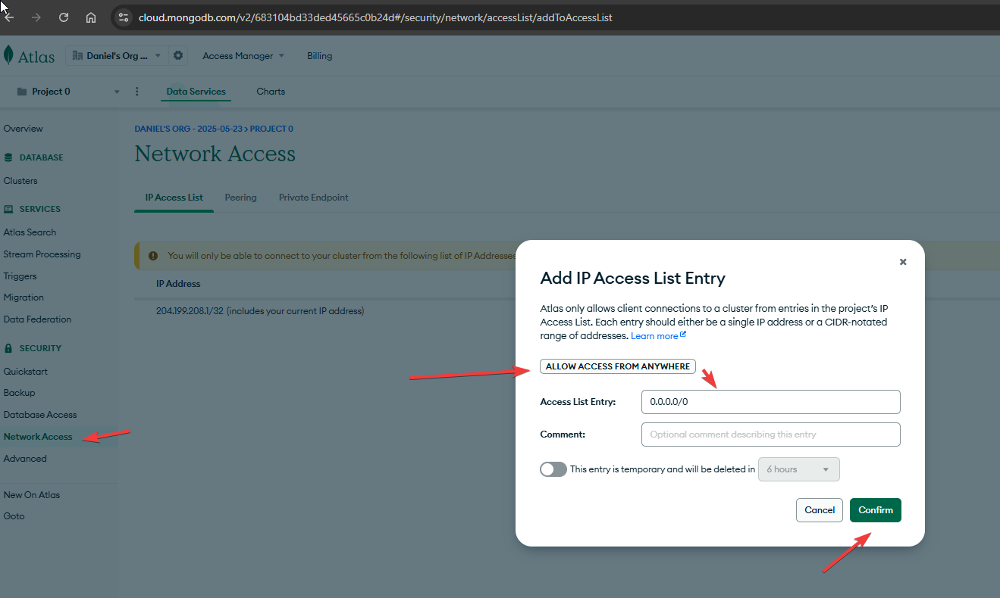
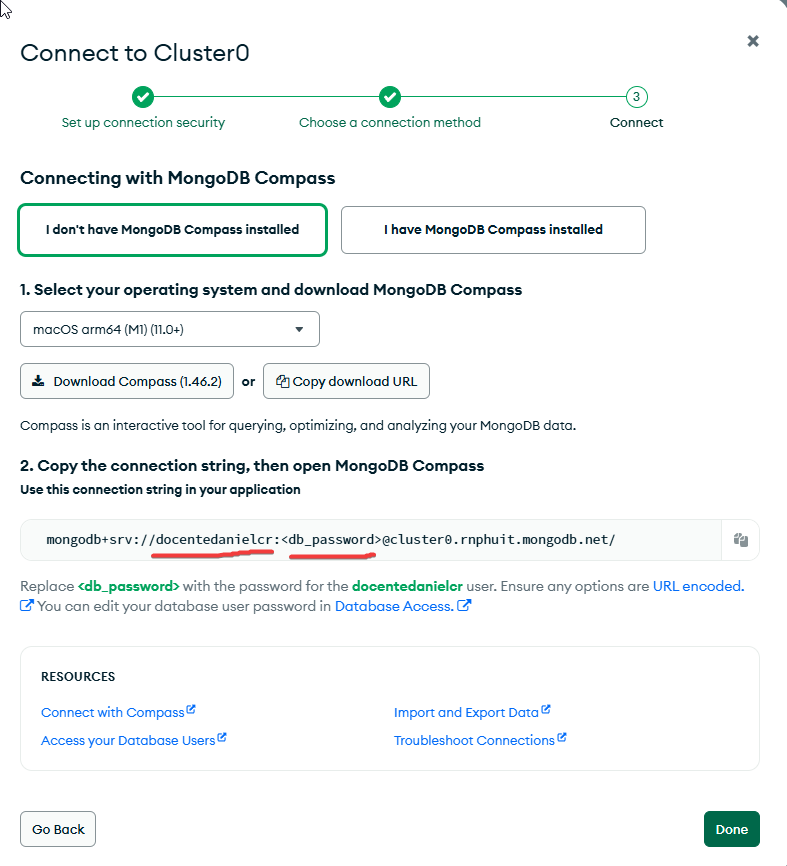
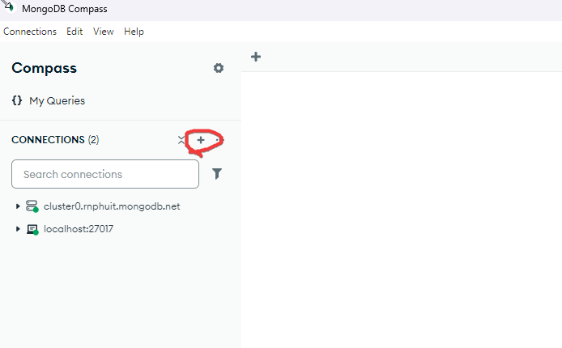
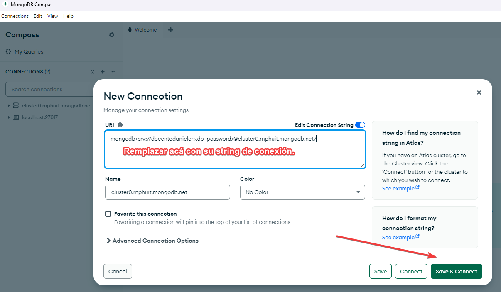

# 🌐 Guía para Crear una Cuenta en MongoDB Atlas y Conectarse con MongoDB Compass

## Conceptos
- MongoDB Atlas es una plataforma de alojamiento en la nube de bases de datos NoSQL.
- MongoDB Compass es un cliente de MongoDB que permite conectarse a la base de datos.

## 🧾 Requisitos
- Tener instalado **MongoDB Compass**:  
  👉 Descargar desde: [https://www.mongodb.com/try/download/compass](https://www.mongodb.com/try/download/compass)

---

## 1️⃣ Crear una Cuenta Gratuita en MongoDB Atlas

1. Ve al sitio web oficial de MongoDB Atlas:  
   👉 [https://www.mongodb.com/cloud/atlas/register](https://www.mongodb.com/cloud/atlas/register)

2. Rellene el formulario de registro o inicia sesión con Google.



3. Saltar la personalización de la cuenta.

3. Selecciona el plan **"Free" (M0)** y haz clic en **Create**.

5. Escoge una región cercana a tu país (ej. `AWS / US East (N. Virginia)`).

6. Dale un nombre a tu clúster o deja el que viene por defecto.

7. Haz clic en **Create Cluster**.



> ✅ Esto puede tardar un par de minutos.

---

## 2️⃣ Crear un Usuario para la Base de Datos

Crear el usuario de la siguiente forma.


### Alternativamente lo puedo hacer asi:

1. Una vez creado el clúster, haz clic en **Database > Database Access** en el menú lateral.

2. Haz clic en **+ ADD NEW DATABASE USER**.

3. Crea un nombre de usuario y una contraseña.  
   ⚠️ **Guarda esta contraseña** para usarla más adelante.

4. En permisos, selecciona **Atlas Admin**.

5. Haz clic en **Add User**.

---

## 3️⃣ Agregar una IP a la Lista Blanca

Esto es necesario para conectarse desde cualquier lugar. si no lo haces, solo puede conectarse desde tu propia IP.

1. Ve a **Network Access** en el menú lateral.

2. Haz clic en **+ ADD IP ADDRESS**.

3. Elige **Allow access from anywhere** (`0.0.0.0/0`).

4. Haz clic en **Confirm**.


---

## 4️⃣ Obtener la Cadena de Conexión

1. Ve a **Database > Clusters**, y en tu clúster haz clic en **Connect**.

2. Selecciona **Connect using MongoDB Compass**.

3. Copia la cadena de conexión que se muestra.  
   Ejemplo:
   ```
   mongodb+srv://<username>:<password>@<cluster>.mongodb.net/test
   ```

4. Reemplaza `<username>` y `<password>` por los datos que creaste.


---

## 5️⃣ Conectarse desde MongoDB Compass

1. Abre **MongoDB Compass**.

2. En el campo de **Connection String**, pega la cadena que copiaste.

3. Haz clic en **Connect**.

4. ¡Listo! Ahora puedes ver tus bases de datos y comenzar a trabajar.



---

## 📌 Recomendaciones Finales

- Puede crear nuevas bases de datos y colecciones desde Compass fácilmente o desde web.
- Recuerda **NO compartir tu contraseña** ni cadena de conexión públicamente.
- Usa esta conexión solo en ambientes de desarrollo.

---

## Documentación oficial:  
👉 [https://www.mongodb.com/docs/atlas/](https://www.mongodb.com/docs/atlas/)
