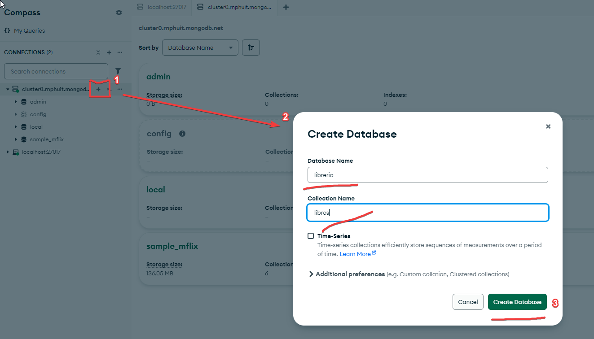
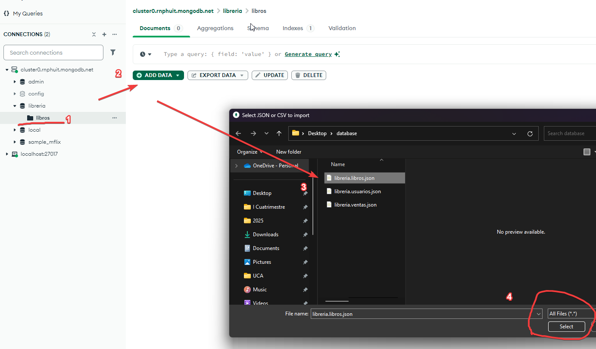
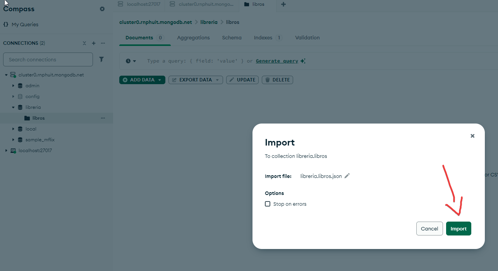
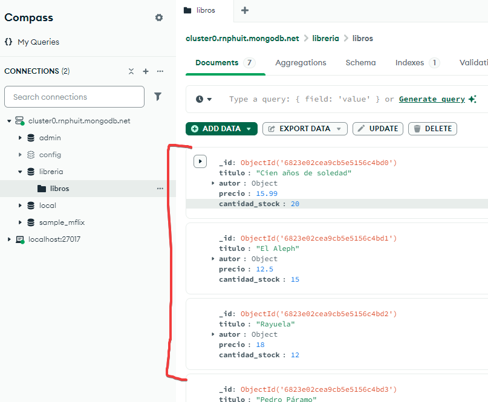

# 📚 Guía para Importar Datos manualmente en MongoDB Compass

## ✅ Requisitos Previos

- Tener **MongoDB Compass** instalado.
- Tener un archivo de datos en alguno de estos formatos:
  - `.json` (JSON o JSON Array) **Preferiblemente**
  - `.csv` (valores separados por coma)

---

## 🧭 Paso 1: Abrir MongoDB Compass y Conectarse

1. Abrí **MongoDB Compass**.
2. Ingrese su URI(string) de conexión (ejemplo para local):
   ```
   mongodb://localhost:27017
   ```
3. Hacé clic en **"Connect"**.

---

## 🗃️ Paso 2: Crear o Seleccionar una Base de Datos

1. En el panel izquierdo, hacé clic en **"Create Database"** si va a crear una nueva.
   - **Database Name**: `libreria`
   - **Collection Name**: `libros`



2. Si ya tiene una base de datos creada, simplemente escogela y lo mismo con la colección.

---

## 📥 Paso 3: Importar Datos

1. Dentro de la colección, hacé clic en el botón **"IMPORT DATA"** (esquina superior derecha).
2. En la ventana emergente, completá lo siguiente:

### ➤ Campos para completar:

- **Select File**: Elegí tu archivo `.json` o `.csv`.
  
  
- **File Type**: Seleccioná el formato correcto:
  - `JSON` si es un archivo `.json`
  - `CSV` si es un archivo `.csv`
- Mongo importará el archivo en la colección seleccionada y deberia de verse similar a esto:
  
- Puede filtrar, editar, eliminar o revisar los datos según lo necesites tanto con la interfaz como con la consola.
- Puede crear una colección para usuarios o ventas si lo desea y realizar el mismo proceso de importación.

---

## 📌 Consejos Útiles

- Valida que las fechas, números y booleanos estén en el formato correcto.
- En caso de errores, Compass mostrará un mensaje antes de importar.

## 🧪 Ejemplo de Archivo JSON Válido

```json
[
{"_id":{"$oid":"6823e02cea9cb5e5156c4bd0"},"titulo":"Cien años de soledad","autor":{"nombre":"Gabriel","apellido":"García Márquez","nacionalidad":"Colombiana"},"precio":15.99,"cantidad_stock":20}
{"_id":{"$oid":"6823e02cea9cb5e5156c4bd1"},"titulo":"El Aleph","autor":{"nombre":"Jorge Luis","apellido":"Borges","nacionalidad":"Argentina"},"precio":12.5,"cantidad_stock":15}
{"_id":{"$oid":"6823e02cea9cb5e5156c4bd2"},"titulo":"Rayuela","autor":{"nombre":"Julio","apellido":"Cortázar","nacionalidad":"Argentina"},"precio":18,"cantidad_stock":12}
{"_id":{"$oid":"6823e02cea9cb5e5156c4bd3"},"titulo":"Pedro Páramo","autor":{"nombre":"Juan","apellido":"Rulfo","nacionalidad":"Mexicana"},"precio":13.75,"cantidad_stock":10}

]
```