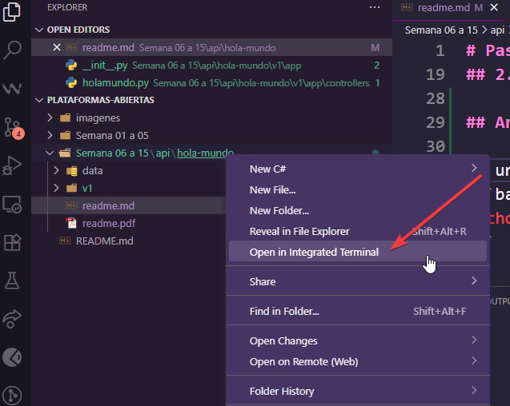
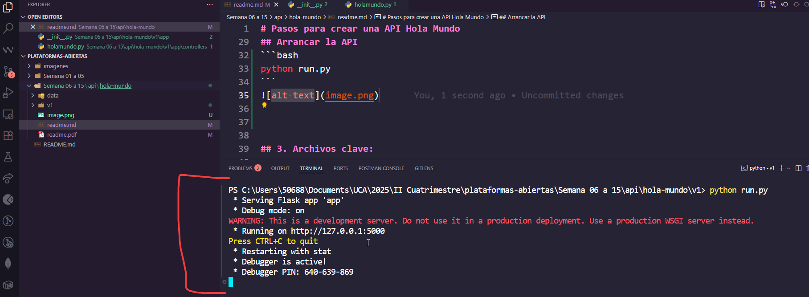

# Pasos para crear una API Hola Mundo

## 1. Crear la siguiente estructura de carpetas y archivos en la carpeta raíz:

```bash 
MI-CARPETA-DE-API
│   readme.md
├───data
└───v1
    │   run.py #Archivo que arranca la API.
    ├───app
    │   │   __init__.py # Crea la app
    │   ├───controllers
    │   │   │   holamundo.py    # Controllador con metodos para endpoint de holamundo.
    │
    └───public
```

## 2. Instalar Flask y Flask-CORS

Ejecuta estos comandos en la terminal (preferiblemente en un entorno virtual):

```bash
pip install flask
pip install flask_cors
pip install db ## Requerida para la base de datos.
```

## 3. Arrancar la API

En una consola dentro del mismo directorio e ingresa a la carpeta `v1` y ejecutar:
```bash
python run.py
```

Si todo salio bien, se vera algo asi:


## 4. Archivos clave:

Acá se muestran los archivos clave de la API:

### `run.py` (punto de entrada)
```python
from app import create_app

app = create_app()

if __name__ == "__main__":
    app.run(debug=True)
```

### `__init__.py` (creación de la app)
```python
from flask import Flask
from flask_cors import CORS
from .controllers.holamundo import holamundo_endpoints

def create_app():
    app = Flask(__name__)
    app.register_blueprint(holamundo_endpoints, url_prefix="/holamundo-ejemplo/api/v1")
    CORS(app, origins="*")
    return app
```

### `holamundo.py` (controller)
```python
from flask import Blueprint, request, jsonify

holamundo_endpoints = Blueprint('holamundo_endpoints', __name__)

@holamundo_endpoints.route('/holamundo', methods=['GET'])
def obtener_ventas():
    holaMundo = "hola mundo"
    return jsonify(holaMundo), 200

@holamundo_endpoints.route('/saludo', methods=['GET'])
def saludar():
    nombre = request.args.get('nombre')
    apellido = request.args.get('apellido')

    if not nombre or not apellido:
        return jsonify({'error': 'Faltan parámetros nombre o apellido'}), 400

    saludo = f"Hola {nombre} {apellido}"
    return jsonify({'saludo': saludo}), 200
```
